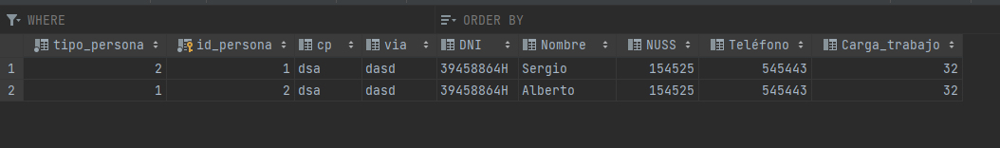
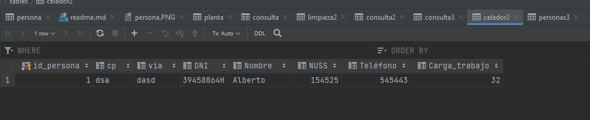
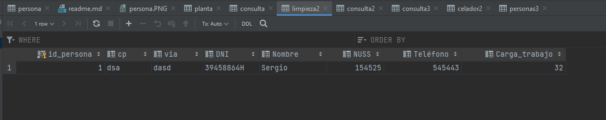
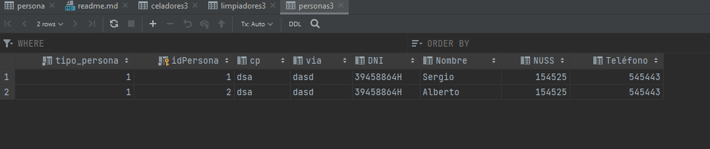
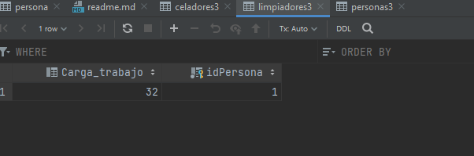
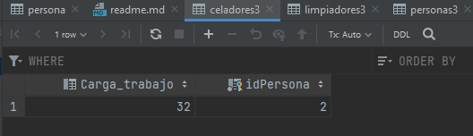

 #TarefaEA.3.3. Herencia y Objetos incrustados en Hibernate
 ##Tipos de herencia en el proyecto:
####Herencia Integer:
Una tabla por las distintas subclases: Se crea una tabla persona en la que se guardan empleado de limpieza, medico, 
celador, y enfermero. Por ejemplo:Limpieza es clase hija de persona por lo tanto aparecerá que tipo de persona es como 
un atributo en la tabla persona y sus atributos específicos aparecerán también ahí

####Herencia Table-Per-Class:
Por cada subclase se crea una tabla que contiene los datos comunes de la superclase y los datos específicos de la 
subclase.Por ejemplo Limpieza2 es clase hija de persona2 y aparecerá una tabla para cada subtipo de persona

####Herencia Joined:
Se crea una tabla genearal con los datos generales(dni, etc) y otra con los especificos de cada subclase.Por ejemplo 
Limpieza3 es clase hija de persona3 por lo tanto aparecerá que tipo de persona es como un atributo en la tabla persona 
y en la tabla del tipo aparecerán sus atributos  específicos(carga_trabajo)

####Cual es la mejor estrategia para este caso?
Considero que la mejor estrategia para este proyecto es
una tabla para cada subclase.
En este proyectos las subclases tienen distintas relaciones y metodos de las otras subclases
y por eso creo que una tabla por cada subclase es la mejor opción.

Dale a tu cuerpo alegria macarena que tu cuerpo es pa´darle alegria y cosa buena
Dale a tu cuerpo alegria macarena, heeeey macarena, aaay

I would take a bullet just to prove my love, only to find out your are the one holding the gun

25 de Diciembre fun fun fun, anananana, funfunfun, que felices seguiremos cundo vengas s mi lado????